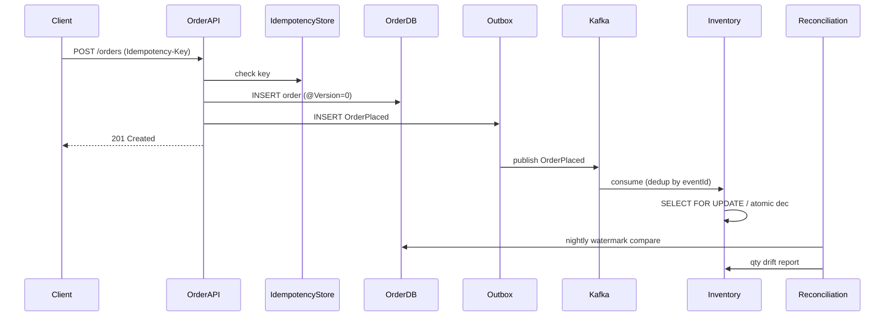

# Data Reliability Mastery — Senior Production Reference

PostgreSQL 15+ / MySQL 8+ / Spring Data JPA / Hibernate 6.x / Kafka 3.x. Distributed microservices on Kubernetes. This is not a getting-started guide. It is the map of what actually breaks in production after years of shipping order pipelines, ledger systems, inventory services, and event-sourced domains where **the data must agree** — even when networks lie, consumers duplicate, and two operators click "Save" at the same time.

---

## Table of Contents

1. [Mental Model: Data Reliability in Distributed Systems](#1-mental-model-data-reliability-in-distributed-systems)
2. [Data Reconciliation](#2-data-reconciliation)
3. [Data Repair](#3-data-repair)
4. [Event Replay Strategies](#4-event-replay-strategies)
5. [Idempotency Keys](#5-idempotency-keys)
6. [Optimistic Locking](#6-optimistic-locking)
7. [Pessimistic Locking](#7-pessimistic-locking)
8. [Lost Update Problem](#8-lost-update-problem)
9. [Combining Patterns — End-to-End Reliability](#9-combining-patterns-end-to-end-reliability)
10. [Production Debugging Playbook](#10-production-debugging-playbook)
11. [Quick Decision Matrix](#11-quick-decision-matrix)
12. [Interview Q&A — 20 Senior Questions](#12-interview-qa-20-senior-questions)

---

## 1. Mental Model: Data Reliability in Distributed Systems

Data reliability is not "ACID on one database." In microservices, **each service owns its database**, messages arrive **at-least-once**, retries duplicate work, and humans run ad-hoc SQL at 2 AM. Reliability means: when reality diverges from intent, you can **detect** it, **explain** it, **repair** it without making things worse, and **prevent** the same class of bug from recurring.

```
                    ┌─────────────────────────────────────────┐
                    │           Source of truth layers         │
                    ├─────────────────────────────────────────┤
  Operational DB ◄──┤  Service A DB   Service B DB   Ledger   │
  (OLTP writes)     │  (orders)       (inventory)    (audit)  │
                    ├─────────────────────────────────────────┤
  Event log       ◄─┤  Kafka topics / outbox / CDC stream      │
  (immutable)       ├─────────────────────────────────────────┤
  Derived views   ◄─┤  Read models / search index / cache      │
  (eventually)      └─────────────────────────────────────────┘

  Reliability tools bridge gaps between layers:
    Reconciliation  → detect drift
    Repair          → correct drift safely
    Replay          → rebuild derived state from log
    Idempotency     → make retries harmless
    Locking         → prevent concurrent lost updates
```

Three failure modes you must keep distinct:

| Failure mode | Question it answers | Typical symptom |
|---|---|---|
| **Lost update** | Did concurrent writes overwrite each other? | Last writer wins; inventory goes negative silently |
| **Duplicate effect** | Did the same logical operation run twice? | Double charge, duplicate shipment |
| **Drift** | Do two stores disagree on facts? | Order total ≠ sum of line items; cache ≠ DB |

A **reconciliation job** finds drift. **Data repair** fixes drift. **Event replay** rebuilds derived state. **Idempotency keys** tame duplicates. **Optimistic/pessimistic locking** tame concurrent writes. Mixing these up — e.g., replay without idempotency, or repair without reconciliation evidence — is how senior incidents become month-long archaeology projects.

The CAP theorem reminder for practitioners: you choose **consistency boundaries**. Inside one aggregate in one DB transaction, you can be strongly consistent. Across services, you choose **eventual consistency** and invest in reconciliation, idempotency, and compensating actions. Pretending HTTP + Kafka gives you cross-service ACID is the root cause of half the production data bugs in fintech and commerce.

---

## 2. Data Reconciliation

### Core concept

**Data reconciliation** is the systematic comparison of two or more data sources that *should* agree, to detect **drift** (discrepancies). It is read-only detection first; correction is a separate **repair** step with its own runbook.

Common reconciliation pairs in microservices:

| Source A | Source B | What should match |
|---|---|---|
| Order service DB | Payment service DB | Order total = captured amount |
| Inventory DB | Warehouse WMS | SKU quantities per location |
| Ledger / accounting | Operational DB | Posted entries = fulfilled orders |
| Kafka compacted topic | Consumer DB | Last event version per aggregate |
| Search index (Elasticsearch) | Primary DB | Document fields for published entities |
| Cache (Redis) | Primary DB | Cached entity snapshot |
| Stripe balance transactions | Internal payment table | External ID ↔ internal ID mapping |

Reconciliation runs on a **schedule** (nightly batch), on **triggers** (after bulk import), or **continuously** (streaming join). The output is a **discrepancy report**: entity ID, field, value A, value B, severity, first seen, suggested action.

### Internal working — batch reconciliation pipeline

```
┌──────────────┐     ┌──────────────┐     ┌──────────────┐
│  Extract A   │     │  Extract B   │     │   Compare    │
│  (cursor /   │────►│  (cursor /   │────►│  (hash join, │
│   watermark) │     │   watermark) │     │   diff keys) │
└──────────────┘     └──────────────┘     └──────┬───────┘
                                                  │
                    ┌──────────────┐              │
                    │  Discrepancy │◄─────────────┘
                    │  store +     │
                    │  alert       │
                    └──────────────┘
```

1. **Watermarking.** Track `last_reconciled_at` or `last_id` per pair so each run is incremental, not full table scan.
2. **Key alignment.** Define canonical join key (`orderId`, `paymentId`, composite `(tenantId, skuId)`).
3. **Tolerance rules.** Not all diffs are bugs — rounding (0.01 currency), clock skew (seconds), intentional lag (cache TTL).
4. **Severity classification.** P0: money mismatch. P1: inventory drift > threshold. P2: search index stale. P3: cosmetic.
5. **Idempotent reporting.** Same drift on consecutive runs should upsert, not duplicate tickets.

### Reconciliation strategies

| Strategy | When to use | Trade-off |
|---|---|---|
| **Full scan** | Small tables, monthly audit | Simple; expensive at scale |
| **Incremental (watermark)** | Large OLTP tables | Misses if watermark logic wrong |
| **Hash bucket compare** | Two large tables, order-independent | Compare hash per bucket; drill into mismatched buckets only |
| **Checksum per partition** | Kafka vs DB counts | Fast sanity check; no row-level detail |
| **Double-entry invariant** | Ledger systems | Sum(debits) = Sum(credits) per account |
| **Event sourcing projection check** | Event store vs read model | Replay hash vs stored projection version |

### Production scenario: order total ≠ payment capture amount

**Problem.** Finance runs month-end close. 847 orders show `order.total_amount != payment.captured_amount`. Sum of delta: $23,400. Support insists "customers weren't overcharged." Engineering insists "payment service is source of truth."

**Cause.** Multiple root causes found after triage:
- Partial refunds posted to payment service but order service never consumed `RefundProcessed` (consumer lag during deploy).
- Currency conversion applied on order side but not payment side for cross-border orders launched two weeks ago.
- Manual adjustment in payment admin UI bypassing event publish.

**Solution — reconciliation job with tiered response:**

```java
@Component
@RequiredArgsConstructor
public class OrderPaymentReconciliationJob {

    private final OrderRepository orderRepo;
    private final PaymentClient paymentClient;
    private final DiscrepancyRepository discrepancyRepo;

    @Scheduled(cron = "0 30 2 * * *") // 02:30 daily
    @Transactional
    public void reconcileSince(LocalDate businessDate) {
        Instant watermark = watermarkService.get("order-payment", businessDate);
        List<OrderSummary> orders = orderRepo.findUpdatedSince(watermark);

        for (OrderSummary order : orders) {
            PaymentSnapshot payment = paymentClient.getByOrderId(order.id());
            MoneyDiff diff = MoneyDiff.of(order.total(), payment.captured());

            if (diff.isWithinTolerance(Money.of("0.01", order.currency()))) {
                continue;
            }

            discrepancyRepo.upsert(Discrepancy.builder()
                .pair("order-payment")
                .entityId(order.id().toString())
                .field("captured_amount")
                .valueA(order.total().toString())
                .valueB(payment.captured().toString())
                .severity(diff.abs().isGreaterThan(Money.of("1.00", order.currency()))
                    ? Severity.P1 : Severity.P2)
                .detectedAt(Instant.now())
                .build());
        }
        watermarkService.advance("order-payment", businessDate);
    }
}
```

Rules that save incidents:

- **Never auto-repair money mismatches** without human review or a pre-approved rules engine.
- Reconcile **incrementally** with watermarks; full scans only in maintenance windows.
- Store **both values** and **detection timestamp** — repair needs audit trail.
- Alert on **new** discrepancies and **growth rate**, not absolute count (legacy drift exists everywhere).
- Cross-check event log: does `PaymentCaptured` exist for each paid order?

### Production scenario: inventory drift after WMS integration

**Problem.** E-commerce shows 50 units available; warehouse system shows 0. Overselling during flash sale. 200 orders cancelled post-purchase.

**Cause.** WMS sends stock adjustments via nightly CSV batch; real-time picks decrement WMS but e-commerce inventory service consumes `StockAdjusted` events with occasional DLQ drops. Batch import **overwrites** intraday decrements without version check.

**Solution.**

1. **Continuous reconciliation** every 15 minutes for SKUs with `available_qty` delta > 5 or any negative.
2. **Version column** on inventory rows; reject WMS batch rows with `version < current`.
3. **Reconciliation report** feeds repair queue (Section 3), not direct SQL UPDATE.

```sql
-- Reconciliation query (simplified)
SELECT i.sku_id,
       i.location_id,
       i.available_qty AS ecommerce_qty,
       w.on_hand_qty   AS wms_qty,
       i.available_qty - w.on_hand_qty AS delta
FROM   inventory i
JOIN   wms_snapshot w ON w.sku_id = i.sku_id AND w.location_id = i.location_id
WHERE  ABS(i.available_qty - w.on_hand_qty) > 5
   OR  i.available_qty < 0;
```

### Common misconfigurations and symptoms

| Misconfiguration | Symptom |
|---|---|
| Reconciliation without watermark | Nightly job overlaps; duplicate alerts; DB load spike |
| Join key mismatch (`orderId` vs `externalOrderId`) | False positives flood on-call; real bugs hidden |
| No tolerance for rounding/time | Thousands of P2 tickets; alert fatigue |
| Reconciliation writes directly to source DB | "Fix" corrupts audit trail; who changed what? |
| Only count-based checks (row counts) | Field-level drift undetected for months |
| Reconcile cache vs DB without TTL awareness | False positives every TTL expiry |
| Single global reconciliation window | Peak traffic job competes with OLTP |

### Debugging scenario

**Observe.** Reconciliation job reports 10,000 new discrepancies overnight after a "harmless" schema migration.

**Diagnose.**

1. Sample 20 discrepancies — is delta pattern uniform (systematic) or random (event loss)?
2. Check migration: did column type change (`NUMERIC(10,2)` → `FLOAT`)?
3. Compare `detected_at` with deploy timeline and consumer lag metrics.
4. Run reconciliation on **pre-migration snapshot** restored to staging — do diffs reproduce?

**Fix.** Roll forward with corrected extraction query; mark batch as `root_cause=schema_migration_2024_03`; do not mass-repair until extraction logic verified.

---

## 3. Data Repair

### Core concept

**Data repair** is the controlled correction of detected drift or corruption. Unlike reconciliation (detect), repair **mutates** state. Every repair must be: **justified** (linked to discrepancy ID), **idempotent** (safe to retry), **audited** (who/what/when/before/after), and **reversible** when possible (compensating entry, not destructive delete).

Repair categories:

| Category | Example | Risk |
|---|---|---|
| **Backfill** | Insert missing `PaymentCaptured` projection row | Medium — duplicate if event actually processed |
| **Corrective UPDATE** | Fix wrong `inventory.available_qty` | High — lost update if concurrent writes |
| **Compensating transaction** | Issue refund + credit note for double charge | High — money movement |
| **Rebuild projection** | Drop read model; replay events | Medium — downtime for read path |
| **Tombstone / soft delete** | Mark duplicate row inactive | Low — if unique constraints allow |
| **Manual ledger adjustment** | Accounting journal entry | Highest — regulatory implications |

### Internal working — repair workflow

```
Discrepancy detected
       │
       ▼
┌──────────────┐     auto-repair allowed?     ┌──────────────┐
│   Triage     │─────────────────────────────►│  Auto-repair │
│   (human or  │  no                          │  (rules eng.)│
│    rules)    │                              └──────┬───────┘
└──────┬───────┘                                     │
       │ manual                                      │
       ▼                                             │
┌──────────────┐                                     │
│ Repair ticket│◄────────────────────────────────────┘
│ + approval   │
└──────┬───────┘
       │
       ▼
┌──────────────┐     ┌──────────────┐     ┌──────────────┐
│  Dry-run     │────►│   Execute    │────►│   Verify     │
│  (preview)   │     │  (txn + audit)│     │  (reconcile) │
└──────────────┘     └──────────────┘     └──────────────┘
```

### Production scenario: missing event projection row

**Problem.** Reconciliation shows order `ORD-8842` marked PAID in order service but no row in `shipment_requests`. Downstream shipping never triggered.

**Cause.** `OrderPaid` event published; shipping consumer threw NPE on null `shippingAddress.line2` before fix deployed. Event went to DLT after retries; offset committed on main topic in misconfigured error handler (at-most-once side effect bug).

**Solution — targeted repair with idempotency:**

```java
@Service
@RequiredArgsConstructor
public class ShipmentRepairService {

    private final EventStore eventStore;
    private final ShipmentRequestRepository shipmentRepo;
    private final RepairAuditRepository auditRepo;

    @Transactional
    public RepairResult repairMissingShipment(UUID orderId, String repairTicketId) {
        // Idempotent: if already exists, no-op success
        if (shipmentRepo.existsByOrderId(orderId)) {
            return RepairResult.alreadyFixed(orderId);
        }

        OrderPaidEvent event = eventStore.load(orderId, OrderPaidEvent.class)
            .orElseThrow(() -> new RepairException("No OrderPaid event for " + orderId));

        ShipmentRequest request = ShipmentRequest.from(event);
        shipmentRepo.save(request);

        auditRepo.save(RepairAudit.builder()
            .ticketId(repairTicketId)
            .entityType("ShipmentRequest")
            .entityId(orderId.toString())
            .action("BACKFILL_FROM_EVENT")
            .payloadSnapshot(event.toJson())
            .performedBy("repair-service")
            .performedAt(Instant.now())
            .build());

        return RepairResult.success(orderId);
    }
}
```

Post-repair: run reconciliation slice for that orderId; confirm shipment request exists; confirm no duplicate shipment created on physical dock (ops check).

### Production scenario: double charge repair

**Problem.** Idempotency gap in payment gateway integration. Customer charged twice for order `ORD-9910`. Support issued verbal refund promise; finance needs ledger correction.

**Cause.** Client retried POST `/charges` without `Idempotency-Key`; gateway created two charges with different `charge_id` for same `orderId`.

**Solution — compensating transaction, not DELETE:**

```java
@Transactional
public void repairDoubleCharge(UUID orderId, String duplicateChargeId, String repairTicketId) {
    Charge original = chargeRepo.findSuccessfulByOrderId(orderId)
        .orElseThrow();
    Charge duplicate = chargeRepo.findByGatewayChargeId(duplicateChargeId)
        .orElseThrow();

    // Idempotent repair
    if (refundRepo.existsByRepairTicketId(repairTicketId)) {
        return;
    }

    Refund refund = paymentGateway.refund(duplicate.gatewayChargeId(),
        RefundRequest.builder()
            .idempotencyKey("repair-" + repairTicketId)
            .reason("duplicate_charge")
            .build());

    refundRepo.save(RefundEntity.from(refund, repairTicketId));
    ledgerService.postCompensatingEntry(
        CompensatingEntry.duplicateCharge(original, duplicate, refund));
    auditRepo.record(repairTicketId, "DOUBLE_CHARGE_REFUND", orderId);
}
```

Never `DELETE FROM charges` — auditors and payment networks require traceability.

### Repair safety rules

1. **Repair ticket required** for manual mutations — JIRA/ServiceNow ID in audit row.
2. **Dry-run mode** returns SQL or domain preview without commit.
3. **One entity per transaction** default; bulk repair only with rate limits and feature flag.
4. **Re-verify with reconciliation** within 5 minutes of repair.
5. **Feature flag** `repair.auto.enabled` per domain — finance off, cache warm-up on.
6. **No repair during active incident** on same aggregate without locking (Section 7).

### Common misconfigurations and symptoms

| Misconfiguration | Symptom |
|---|---|
| Repair script without idempotency | Second run double-refunds customer |
| Direct prod SQL from laptop | No audit; wrong WHERE clause affects 10k rows |
| Repair before root cause fixed | Same discrepancy reappears nightly |
| DELETE instead of compensating entry | Audit trail broken; regulatory failure |
| Bulk repair without batch size limit | DB lock storm; replication lag |
| Repair bypasses domain logic | Business rules violated (e.g., ship to blocked country) |

### Debugging scenario

**Observe.** After mass repair job, reconciliation shows *more* discrepancies than before.

**Diagnose.** Compare repair audit log timestamps with new discrepancy `detected_at`. Check if repair used stale snapshot (read order total before refund event processed). Look for repair records without matching `repair_ticket_id`.

**Fix.** Pause repair job; roll forward with corrected logic on affected ID range only; add post-repair reconciliation gate before closing ticket.

---

## 4. Event Replay Strategies

### Core concept

**Event replay** re-processes historical events to rebuild state, recover from bugs, or migrate schemas. The event log (Kafka topic, event store table, outbox archive) is the **input tape**; handlers are the **pure function** (ideally) applied again. Replay is dangerous when handlers are not idempotent, when side effects fire twice (emails, charges), or when downstream cannot distinguish live vs replay traffic.

Replay modes:

| Mode | Description | Side effects |
|---|---|---|
| **Full replay** | All events from epoch | Must suppress or sandbox external calls |
| **Partial replay** | Time range or aggregate ID set | Targeted recovery |
| **Forward replay** | From offset/version N to head | Catch-up after bug fix |
| **Shadow replay** | Write to alternate table/topic | Compare outputs before cutover |
| **Dry replay** | Log intended mutations only | Safe analysis |

### Internal working — replay architecture

```
Event log (Kafka / event_store)
         │
         ▼
┌─────────────────┐
│ Replay controller│  rate limit, filter, routing header
└────────┬────────┘
         │
    ┌────┴────┐
    ▼         ▼
 Live        Shadow
 handler     handler
    │         │
    ▼         ▼
 Primary DB  shadow_orders_v2
```

**Replay controller** responsibilities:

- Set header `X-Replay-Mode: true` or dedicated consumer group `orders-replay-2024-03-fix`
- Rate limit (messages/sec) to protect DB
- Filter: `aggregateId IN (...)` or `timestamp BETWEEN ...`
- Skip or stub external gateways (payment, email)
- Track progress checkpoint for resume

### Strategy 1: New consumer group (Kafka)

Safest for read-model rebuild when live traffic continues.

```bash
# New group starts from earliest (or by timestamp)
kafka-consumer-groups.sh --bootstrap-server $BS \
  --group orders-projection-rebuild-v2 \
  --reset-offsets --to-datetime 2024-03-01T00:00:00.000 \
  --topic orders.events --execute

# Start replay consumers (separate deployment)
kubectl scale deployment/order-projection-replay --replicas=6
```

Live consumer group `orders-projection` **unchanged**. Replay group writes to `orders_read_model_v2` or uses `INSERT ... ON CONFLICT` into same table **only if** handlers idempotent.

### Strategy 2: Event store table replay ( JDBC )

For event-sourced services storing events in PostgreSQL:

```java
@Service
public class ProjectionReplayer {

    public void replay(UUID aggregateId, long fromVersion) {
        List<DomainEvent> events = eventStore.loadFrom(aggregateId, fromVersion);
        for (DomainEvent event : events) {
            projection.apply(event); // must be deterministic + idempotent
        }
    }

    public void rebuildAll(Instant from, Duration rateLimit) {
        try (Stream<StoredEvent> stream = eventStore.streamFrom(from)) {
            RateLimiter limiter = RateLimiter.create(rateLimit.toSeconds());
            stream.forEach(e -> {
                limiter.acquire();
                projection.apply(e.payload());
            });
        }
    }
}
```

### Strategy 3: Shadow table + cutover

1. Replay into `orders_read_shadow`.
2. Reconciliation: `hash(primary) vs hash(shadow)` per partition.
3. Atomic rename or blue/green read switch.

```sql
-- Cutover (maintenance window)
BEGIN;
ALTER TABLE orders_read RENAME TO orders_read_old;
ALTER TABLE orders_read_shadow RENAME TO orders_read;
-- recreate indexes, grants
COMMIT;
```

### Strategy 4: Versioned projection handlers

When event schema evolved, use **upcasters** during replay:

```java
public DomainEvent upcast(StoredEvent raw) {
    if (raw.schemaVersion() == 1) {
        OrderPlacedV1 v1 = deserialize(raw);
        return new OrderPlacedV2(v1.orderId(), v1.items(), Money.ZERO); // new field default
    }
    return deserialize(raw);
}
```

### Production scenario: bug in pricing projection deployed for 6 hours

**Problem.** Discount logic ignored `couponStackable=false`. 4,000 orders have wrong `projected_total` in read model. Billing uses read model for invoice PDF.

**Cause.** Bug in `OrderDiscountApplied` handler; event log is correct; projection wrong.

**Solution.**

1. Fix handler code; deploy as `pricing-projection v2.3.1`.
2. Identify affected range: events with type `CouponApplied` between deploy timestamps.
3. Shadow replay into `invoice_snapshots_rebuild` for affected `orderId` set.
4. Reconciliation report: 4,000 diffs, all match expected correction formula.
5. Swap read path with feature flag; archive old snapshots.

```java
@KafkaListener(
    topics = "orders.events",
    groupId = "pricing-replay-20240315",
    properties = {"auto.offset.reset=earliest"}
)
public void replay(CouponAppliedEvent event, @Header(KafkaHeaders.RECEIVED_TIMESTAMP) long ts) {
    if (ts < incidentStart || ts > incidentEnd) {
        return; // skip unrelated
    }
    if (!affectedOrderIds.contains(event.orderId())) {
        return;
    }
    replayModeContext.run(() -> pricingProjection.apply(event));
}
```

### Production scenario: replay triggers duplicate emails

**Problem.** Team replays `UserRegistered` events to fix CRM sync. 50,000 users receive duplicate welcome emails. Marketing escalation.

**Cause.** Handler calls `emailService.sendWelcome()` unconditionally; replay treated as live.

**Solution — side-effect gate:**

```java
public void on(UserRegisteredEvent event) {
    crmSync.upsertUser(event); // idempotent — OK on replay

    if (!ReplayContext.isReplay()) {
        emailService.sendWelcome(event.userId()); // live only
    }
}

// ReplayContext set by interceptor from header or consumer group name
```

Better: separate **integration events** from **domain events**; replay domain events only; integration handlers subscribe with dedup.

### Replay checklist (production runbook excerpt)

1. [ ] Root cause fixed in handler code
2. [ ] Handlers verified idempotent (Section 5)
3. [ ] External side effects gated or stubbed
4. [ ] Dedicated consumer group / replay flag
5. [ ] Rate limit calculated (DB IOPS, connection pool)
6. [ ] Retention covers replay window (Kafka `retention.ms`)
7. [ ] Reconciliation criteria defined before start
8. [ ] Rollback plan (shadow table, flag revert)
9. [ ] Stakeholder comms if customer-visible
10. [ ] Progress dashboard (lag, rows updated/sec, error rate)

### Common misconfigurations and symptoms

| Misconfiguration | Symptom |
|---|---|
| Reset live consumer group offsets | Double processing in prod; duplicate charges |
| Replay without rate limit | DB CPU 100%; replication lag; site slow |
| Non-idempotent handler | Duplicate rows; unique constraint violations |
| Replay past retention | Missing events; incomplete rebuild |
| Same consumer group for live + replay | Partition assignment fight; chaos |
| Replay without schema upcasting | Deserialization failures mid-stream |
| Side effects not gated | Duplicate emails, webhooks, charges |

### Debugging scenario

**Observe.** Replay job at 80% complete; error rate spikes on `UniqueConstraintViolationException`.

**Diagnose.** Handler uses `INSERT` not `UPSERT`; first pass partially succeeded before retry. Check idempotency table — are events marked processed?

**Fix.** Pause replay; change handler to `ON CONFLICT DO UPDATE` or skip if `processed_events` contains ID; resume from last checkpoint minus safe overlap window.

---

## 5. Idempotency Keys

### Core concept

An **idempotency key** is a client-supplied (or system-generated) unique token identifying a **logical operation**. The server stores `key → result` (or `key → in-progress`) so duplicate requests with the same key return the **same outcome** without re-executing side effects. Idempotency turns at-least-once delivery into **effectively-once** behavior at the application layer.

Idempotency applies at multiple boundaries:

| Boundary | Key source | Store TTL |
|---|---|---|
| HTTP API | `Idempotency-Key` header | 24h typical (Stripe model) |
| Message consumer | `eventId` / `messageId` | Forever or retention-aligned |
| Database write | Natural key / business ID | Permanent unique constraint |
| Payment gateway | Merchant reference ID | Provider-specific |
| Scheduled job | `(jobName, businessDate, entityId)` | Job duration |

### Internal working — HTTP idempotency flow

```
Client                          Server                         Store
  │                               │                              │
  │ POST /orders                  │                              │
  │ Idempotency-Key: abc-123      │                              │
  ├──────────────────────────────►│ BEGIN TX                     │
  │                               │ INSERT idempotency_keys      │
  │                               │   (key, status=IN_PROGRESS)  │
  │                               ├─────────────────────────────►│
  │                               │ IF conflict:                 │
  │                               │   return cached response     │
  │                               │ execute business logic       │
  │                               │ UPDATE status=COMPLETED      │
  │                               │   + response_body            │
  │                               │ COMMIT                       │
  │◄──────────────────────────────┤                              │
  │ 201 + body                    │                              │
  │                               │                              │
  │ POST /orders (retry)          │                              │
  │ Idempotency-Key: abc-123      │                              │
  ├──────────────────────────────►│ lookup COMPLETED             │
  │◄──────────────────────────────┤ return same 201 + body       │
```

**Critical detail:** the idempotency record must be created **before** side effects, in the same transaction as business writes when possible, or with `IN_PROGRESS` lock to prevent concurrent duplicate execution.

### Implementation — Spring service pattern

```java
@Service
@RequiredArgsConstructor
public class IdempotencyService {

    private final IdempotencyKeyRepository repo;
    private final ObjectMapper mapper;

    @Transactional
    public <T> T execute(String key, String scope, Supplier<T> action, Class<T> responseType) {
        Optional<IdempotencyRecord> existing = repo.findByKeyAndScope(key, scope);
        if (existing.isPresent()) {
            IdempotencyRecord rec = existing.get();
            if (rec.status() == Status.COMPLETED) {
                return mapper.readValue(rec.responseBody(), responseType);
            }
            if (rec.status() == Status.IN_PROGRESS) {
                throw new ConflictException("Request in progress for key: " + key);
            }
        }

        repo.save(new IdempotencyRecord(key, scope, Status.IN_PROGRESS, null));

        try {
            T result = action.get();
            repo.save(new IdempotencyRecord(key, scope, Status.COMPLETED, mapper.writeValueAsString(result)));
            return result;
        } catch (Exception ex) {
            repo.deleteByKeyAndScope(key, scope); // allow retry on failure — or mark FAILED
            throw ex;
        }
    }
}
```

```java
@PostMapping("/orders")
public ResponseEntity<OrderResponse> create(
        @RequestHeader("Idempotency-Key") String idempotencyKey,
        @RequestBody CreateOrderRequest request) {

    OrderResponse response = idempotencyService.execute(
        idempotencyKey,
        "create-order",
        () -> orderService.create(request),
        OrderResponse.class);

    return ResponseEntity.status(HttpStatus.CREATED).body(response);
}
```

### Message consumer idempotency

```java
@KafkaListener(topics = "payments.events")
@Transactional
public void on(PaymentCapturedEvent event) {
    boolean firstTime = processedEventRepo.insertIfAbsent(event.eventId());
    if (!firstTime) {
        log.debug("Duplicate event {}", event.eventId());
        return;
    }
    orderService.markPaid(event.orderId(), event.amount());
}
```

```sql
CREATE TABLE processed_events (
    event_id   VARCHAR(64) PRIMARY KEY,
    processed_at TIMESTAMPTZ NOT NULL DEFAULT now()
);
-- INSERT ... ON CONFLICT DO NOTHING returning event_id
```

### Idempotency key design rules

| Rule | Rationale |
|---|---|
| Keys must be **unique per logical operation** | Same key for different operations returns wrong cached response |
| Scope keys by **tenant + operation** | Global key space collisions across customers |
| TTL ≥ max client retry window | After expiry, duplicate retry creates second effect |
| Return **same HTTP status + body** on replay | Clients depend on stable responses |
| Hash request body optionally | Reject same key with different body (409 Conflict) |
| `IN_PROGRESS` timeout | Stale lock from crashed worker — allow takeover after N minutes |

### Production scenario: mobile app double-tap submit

**Problem.** Users double-tap "Place Order" on slow network. Two orders created 400ms apart with different IDs but same cart.

**Cause.** Client generated new UUID per request; no idempotency key; server treated as two creates.

**Solution.**

```typescript
// Client: stable key per checkout session
const idempotencyKey = checkoutSessionId; // UUID created when cart opened
await fetch('/api/orders', {
  method: 'POST',
  headers: { 'Idempotency-Key': idempotencyKey },
  body: JSON.stringify(cart)
});
```

Server rejects or returns cached response for duplicate key within 24h.

### Production scenario: same key, different payload

**Problem.** API client bug reuses idempotency key across different customers' orders. Customer B receives Customer A's order confirmation.

**Cause.** Key scoped globally; no request body hash validation.

**Solution.**

```java
String payloadHash = sha256(canonicalJson(request));
IdempotencyRecord rec = repo.find(key, scope);
if (rec != null && !rec.payloadHash().equals(payloadHash)) {
    throw new IdempotencyConflictException("Key reused with different payload");
}
```

### Natural idempotency vs explicit keys

Some operations are **naturally idempotent**:

| Operation | Naturally idempotent? |
|---|---|
| `PUT /users/123 { name: "Ada" }` | Yes — same state |
| `DELETE /users/123` | Yes — second delete 404 OK |
| `POST /orders` | No — creates new resource |
| `UPDATE balance SET x = x + 10` | No — not idempotent |
| `UPDATE balance SET x = 100 WHERE id = 1` | Yes — if target value absolute |
| `INSERT ... ON CONFLICT DO UPDATE` | Yes — with stable key |

Prefer natural idempotency (UPSERT, absolute SET) where domain allows; explicit keys for creates and external API calls.

### Common misconfigurations and symptoms

| Misconfiguration | Symptom |
|---|---|
| Idempotency store after side effect | Duplicate charges on retry |
| No `IN_PROGRESS` handling | Concurrent duplicates with same key |
| Key TTL too short (1h) | Mobile offline retry next day duplicates |
| Store response without status code | Client misinterprets replay |
| Consumer dedup table unbounded | Disk full after years |
| Idempotency only on API, not consumer | Event redelivery duplicates write |
| Reuse keys across environments | Staging key returns prod cached response |

### Debugging scenario

**Observe.** Sporadic 409 "Request in progress" for idempotent POST; resolves after 5 minutes.

**Diagnose.** Worker crashed after `IN_PROGRESS` insert, before COMPLETE. No stale lock sweeper. Check `idempotency_keys` for `status=IN_PROGRESS AND created_at < now() - interval '5 min'`.

**Fix.** Scheduled job marks stale IN_PROGRESS as FAILED or deletes; client retry policy uses exponential backoff; consider PostgreSQL advisory lock instead of row status for short operations.

---

## 6. Optimistic Locking

### Core concept

**Optimistic locking** assumes conflicts are **rare**. Read entity with a **version** (integer, timestamp, or hash); on write, UPDATE succeeds only if version unchanged. If another transaction modified the row first, UPDATE affects 0 rows → **OptimisticLockException** → application retries or returns 409 Conflict.

No database row locks held during business logic — high throughput, but failed writes under contention.

JPA `@Version`:

```java
@Entity
public class InventoryItem {

    @Id
    private UUID id;

    private int availableQty;

    @Version
    private Long version;
}
```

Hibernate generates:

```sql
UPDATE inventory_item
SET available_qty = ?, version = version + 1
WHERE id = ? AND version = ?;
-- if version mismatch: 0 rows updated → OptimisticLockException
```

### Internal working — read-modify-write lifecycle

```
Thread A                          Thread B
   │                                 │
   │ SELECT * (v=3)                  │
   │                                 │ SELECT * (v=3)
   │ compute qty -= 2 → 8            │
   │                                 │ compute qty -= 5 → 5
   │ UPDATE ... WHERE v=3 ✓ (v→4)    │
   │                                 │ UPDATE ... WHERE v=3 ✗ (0 rows)
   │                                 │ OptimisticLockException
   │                                 │ retry: SELECT (v=4), recompute
```

### Production scenario: concurrent order cancellation and shipment

**Problem.** Customer cancels order while warehouse marks shipped. Final state: CANCELLED in order service but shipment label printed.

**Cause.** Two services update shared `order_status` via REST without versioning; last write wins.

**Solution — optimistic version on aggregate:**

```java
@Entity
public class Order {
    @Id private UUID id;
    @Enumerated(EnumType.STRING) private OrderStatus status;
    @Version private Long version;
}

@Service
public class OrderService {

    @Transactional
    public void cancel(UUID orderId, long expectedVersion) {
        Order order = orderRepo.findById(orderId).orElseThrow();
        if (!order.getVersion().equals(expectedVersion)) {
            throw new ConflictException("Order modified; refresh and retry");
        }
        if (order.getStatus() == SHIPPED) {
            throw new BusinessRuleException("Cannot cancel shipped order");
        }
        order.setStatus(CANCELLED);
        // version auto-increment on flush
    }
}
```

API exposes `ETag: "v-7"` or `version` field; client sends `If-Match` or `expectedVersion`.

### Production scenario: optimistic lock retry storm on flash sale

**Problem.** 10,000 concurrent purchases on 100 units. Every failed optimistic lock retries immediately. DB CPU saturates; site down.

**Cause.** No backoff; retry in tight loop; hot row on single SKU.

**Solution.**

1. **Pessimistic lock** or **atomic decrement** for inventory hot path (Section 7).
2. Optimistic locking on low-contention aggregates (order metadata).
3. Exponential backoff on conflict:

```java
@Retryable(retryFor = OptimisticLockException.class,
           maxAttempts = 3,
           backoff = @Backoff(delay = 50, multiplier = 2, random = true))
public void updateOrderMetadata(UUID id, MetadataUpdate update) { ... }
```

4. Atomic SQL for stock: `UPDATE inventory SET qty = qty - 1 WHERE sku = ? AND qty > 0`.

### Version field alternatives

| Approach | Pros | Cons |
|---|---|---|
| `@Version Long` | JPA native; portable | Extra column; wraps at Long.MAX (theoretical) |
| `updated_at` timestamp | Human readable | Clock skew; same-ms collisions |
| Hash of row | No extra semantic | Expensive to compute |
| Event stream version | Aligns with event sourcing | Requires event store |

### Common misconfigurations and symptoms

| Misconfiguration | Symptom |
|---|---|
| `@Version` on entity but DTO bypasses it | Lost updates continue |
| Catch `OptimisticLockException` and swallow | Silent data loss |
| Version not exposed to API client | Client cannot retry intelligently |
| Optimistic lock on hot row (global counter) | Constant conflicts; retry storm |
| Detached entity stale version | Every save fails in batch jobs |
| `@Version` missing on child in aggregate | Parent version doesn't protect children |

### Debugging scenario

**Observe.** Support tool updates order; random 409 Conflict; refresh fixes it.

**Diagnose.** Background job updates `updated_at` every minute for SLA tracking; bumps version. Support UI sends stale version from page load.

**Fix.** Include version in support UI; auto-refresh on 409; or move SLA tracking to separate table without touching order version.

---

## 7. Pessimistic Locking

### Core concept

**Pessimistic locking** assumes conflicts are **likely**. The transaction acquires a **database row lock** (`SELECT ... FOR UPDATE`) before reading or modifying, blocking other transactions until commit/rollback. Guarantees no concurrent lost update on that row — at the cost of **blocking**, **deadlock risk**, and **reduced concurrency**.

JPA patterns:

```java
@Lock(LockModeType.PESSIMISTIC_WRITE)
@Query("SELECT i FROM InventoryItem i WHERE i.skuId = :skuId")
Optional<InventoryItem> findForUpdate(@Param("skuId") String skuId);
```

Hibernate emits:

```sql
SELECT * FROM inventory_item WHERE sku_id = ? FOR UPDATE;
-- PostgreSQL: row-level exclusive lock until transaction end
```

Lock modes:

| JPA LockMode | SQL (PostgreSQL) | Behavior |
|---|---|---|
| `PESSIMISTIC_READ` | `FOR SHARE` | Others can read; writers block |
| `PESSIMISTIC_WRITE` | `FOR UPDATE` | Exclusive row lock |
| `PESSIMISTIC_FORCE_INCREMENT` | `FOR UPDATE` + version bump | Combines with `@Version` |

### Internal working — lock duration

Locks are held from `SELECT FOR UPDATE` until **transaction commit**. Long business logic inside the transaction extends lock duration — anti-pattern.

```
BEGIN;
SELECT * FROM inventory WHERE sku = 'ABC' FOR UPDATE;  -- lock acquired
-- BAD: call external payment API (2 seconds) while holding lock
UPDATE inventory SET qty = qty - 1 WHERE sku = 'ABC';
COMMIT;  -- lock released
```

**Pattern:** lock → short read-modify-write → commit → then external calls.

### Production scenario: inventory overselling prevented

**Problem.** Flash sale; 100 units; 500 concurrent checkout attempts; without locking, 120 orders confirmed.

**Solution — pessimistic lock in short transaction:**

```java
@Service
@RequiredArgsConstructor
public class InventoryService {

    @Transactional
    public Reservation reserve(String skuId, int quantity) {
        InventoryItem item = inventoryRepo.findForUpdate(skuId)
            .orElseThrow(() -> new NotFoundException(skuId));

        if (item.getAvailableQty() < quantity) {
            throw new InsufficientStockException(skuId);
        }
        item.setAvailableQty(item.getAvailableQty() - quantity);
        return reservationRepo.save(new Reservation(skuId, quantity));
    }
}
```

Alternative without ORM — single atomic statement (often better for hot SKU):

```sql
UPDATE inventory
SET available_qty = available_qty - :qty
WHERE sku_id = :sku
  AND available_qty >= :qty
RETURNING available_qty;
-- 0 rows → insufficient stock
```

### Production scenario: deadlock on transfer between accounts

**Problem.** Transfer from Account A → B and concurrent B → A. Both transactions lock A then B in different order. PostgreSQL detects deadlock; one transaction aborted.

**Cause.**

```
Tx1: lock A, wait B
Tx2: lock B, wait A  → deadlock
```

**Solution — consistent lock ordering:**

```java
@Transactional
public void transfer(UUID fromId, UUID toId, Money amount) {
    UUID first = fromId.compareTo(toId) < 0 ? fromId : toId;
    UUID second = fromId.compareTo(toId) < 0 ? toId : fromId;

    Account firstAcc = accountRepo.findForUpdate(first).orElseThrow();
    Account secondAcc = accountRepo.findForUpdate(second).orElseThrow();
    // debit/credit logic
}
```

Always lock rows in **deterministic order** (by ID sort). Document for all developers touching multi-row updates.

### Pessimistic vs serializable

| Level | Scope | Use when |
|---|---|---|
| Row `FOR UPDATE` | Single row(s) explicitly locked | Hot entity, known contention |
| `SERIALIZABLE` isolation | Whole transaction phantom protection | Complex invariant across rows; perf cost |
| Advisory lock (`pg_advisory_xact_lock`) | Application-defined key | Cross-table logical lock |

```java
// PostgreSQL advisory lock for aggregate
entityManager.createNativeQuery(
    "SELECT pg_advisory_xact_lock(:key)")
    .setParameter("key", aggregateId.hashCode())
    .getSingleResult();
```

### Distributed lock caution

Redis `SETNX`, ZooKeeper, DB advisory locks across services — use when **single DB transaction cannot span services**. Pitfalls: lock not released on crash (TTL needed), clock skew, split brain. Prefer **Saga + idempotency** over distributed locks for cross-service invariants.

### Common misconfigurations and symptoms

| Misconfiguration | Symptom |
|---|---|
| `FOR UPDATE` with long transaction | Connection pool exhaustion; p99 latency spikes |
| Lock without index on WHERE column | Table lock scan — kills throughput |
| Nested transactions different isolation | Lock released unexpectedly |
| Pessimistic lock across microservices | Not possible in one TX — faux locks |
| No deadlock retry | Random 400 errors to users |
| `SKIP LOCKED` not used for queue work | Workers block each other |

### Debugging scenario — lock wait timeout

**Observe.** Checkout times out after 30s during sale. PostgreSQL `pg_locks` shows many `waiting` on same `sku_id`.

**Diagnose.**

```sql
SELECT pid, mode, granted, relation::regclass, query
FROM pg_stat_activity
JOIN pg_locks USING (pid)
WHERE NOT granted OR relation = 'inventory_item'::regclass;
```

Find long-running transaction holding lock (maybe batch job).

**Fix.** Kill rogue session; shorten transaction; move to atomic UPDATE; use `NOWAIT` or timeout:

```java
@QueryHints({@QueryHint(name = "jakarta.persistence.lock.timeout", value = "3000")})
@Lock(LockModeType.PESSIMISTIC_WRITE)
InventoryItem findForUpdateWithTimeout(String skuId);
```

---

## 8. Lost Update Problem

### Core concept

The **lost update problem** occurs when two transactions read the same data, modify it independently, and commit sequentially — the **second commit overwrites the first** without incorporating its changes. The first update is **lost** as if it never happened.

Classic example:

```
Initial: balance = 100

Tx1: READ 100 → WRITE 100 + 50 = 150 → COMMIT
Tx2: READ 100 → WRITE 100 + 20 = 120 → COMMIT  (started before Tx1 commit)

Final: 120  (Tx1's +50 is LOST; should be 170)
```

This is **not** a duplicate problem — it is **concurrency**. Idempotency keys do not fix lost updates. You need **locking**, **atomic operations**, or **merge semantics**.

### Lost update variants in microservices

| Variant | Mechanism | Example |
|---|---|---|
| **Read-modify-write race** | Two threads, one row | Inventory count |
| **Last-write-wins (LWW)** | Cassandra/Dynamo without CRDT | Profile field overwrite |
| **Cross-service lost update** | Service A and B both read cache, write DB | Two partial updates to order |
| **Event ordering** | `StockAdjusted(+5)` and `StockAdjusted(-3)` applied wrong order | Wrong final qty |
| **Retry overwrite** | Stale retry writes old value | Mobile offline sync |

### Solutions mapped to problem

| Solution | How it prevents lost update |
|---|---|
| **Pessimistic locking** | Second tx waits or fails |
| **Optimistic locking** | Second tx gets 0 rows updated → retry |
| **Atomic SQL** | `SET x = x + 10` not read-modify-write |
| **Compare-and-swap (CAS)** | Update only if value = expected |
| **Field-level merge** | Patch semantics; don't replace whole document |
| **Event sourcing + versioning** | Reject event if aggregate version stale |
| **CRDT / LWW with vector clock** | Merge function for concurrent edits |

### Production scenario: CRM note overwrite

**Problem.** Two support agents edit different fields of customer note simultaneously. Agent B saves last; Agent A's phone number update vanishes.

**Cause.** API uses `PUT /notes/{id}` replacing entire JSON document.

**Solution — PATCH with field-level merge or JSON patch:**

```java
@PatchMapping("/notes/{id}")
public Note patch(@PathVariable UUID id,
                  @RequestBody JsonMergePatch patch,
                  @RequestHeader("If-Match") String etag) {
    Note current = noteRepo.findById(id).orElseThrow();
    if (!etagMatches(current.getVersion(), etag)) {
        throw new PreconditionFailedException("Stale version");
    }
    Note patched = patch.apply(current);
    return noteRepo.save(patched);
}
```

Or operational transform / CRDT for real-time collaborative editing.

### Production scenario: lost update in microservice choreography

**Problem.** Order service sets `status=PAID`. Notification service sets `notification_sent=true` on same `orders` table row (shared DB anti-pattern). Both read row at T0; both write; one flag lost.

**Cause.** Shared database between services — violates bounded context; no locking coordination.

**Solution.**

1. **Proper boundary:** each service owns its table; order publishes event; notification owns `notification_log`.
2. If shared DB unavoidable: **separate columns with atomic updates**:

```sql
UPDATE orders SET status = 'PAID' WHERE id = ? AND status = 'PENDING';
UPDATE orders SET notification_sent = true WHERE id = ?;
-- different columns — PostgreSQL row lock still serializes full row updates
```

Better: separate tables entirely.

### Atomic operations — preferred for counters

```java
@Modifying
@Query("UPDATE InventoryItem i SET i.availableQty = i.availableQty - :qty " +
       "WHERE i.skuId = :skuId AND i.availableQty >= :qty")
int decrementIfAvailable(@Param("skuId") String skuId, @Param("qty") int qty);
```

Returns affected row count — 0 means insufficient stock, no lost update possible on quantity.

### Hibernate dirty checking lost update

Even without explicit read-modify-write in code, Hibernate can lost-update if two sessions load same entity:

```java
// Session 1                    // Session 2
order.setNotes("A");            order.setPriority(HIGH);
orderRepo.save(order);          orderRepo.save(order);
// priority update may overwrite notes if no @Version
```

`@Version` on entity triggers optimistic lock on flush.

### Detection — reconciliation for lost updates

Sometimes lost updates manifest as **impossible states**:

```sql
-- Inventory never negative invariant
SELECT * FROM inventory WHERE available_qty < 0;

-- Status machine violation
SELECT * FROM orders WHERE status = 'SHIPPED' AND paid_at IS NULL;
```

Scheduled invariant checks catch lost updates that slipped past locking gaps.

### Common misconfigurations and symptoms

| Misconfiguration | Symptom |
|---|---|
| Full PUT replace for multi-field resource | Field-level lost updates |
| No `@Version` on concurrent entities | Intermittent wrong totals |
| Read-modify-write outside transaction | Race window |
| Cache-aside without invalidation | Stale read → overwrite fresh DB |
| LWW in distributed cache | Ghost writes after network partition |
| Assuming Kafka partition order fixes all | Cross-partition events still race |

### Debugging scenario

**Observe.** Account balance occasionally $50 low; no failed transactions in logs.

**Diagnose.** Enable PostgreSQL `log_statement = 'all'` on staging reproduce. Look for pattern: two UPDATEs same row, no locking, read same initial value. Check application for `@Transactional` boundary — is read outside write transaction?

**Fix.** Add `@Version`; use `SET balance = balance + :delta`; add reconciliation job comparing ledger sum vs balance.

---

## 9. Combining Patterns — End-to-End Reliability

Real systems stack patterns. A payment flow might use:

```
HTTP Idempotency-Key
  → Order aggregate (optimistic @Version)
  → Outbox publish
  → Kafka (at-least-once)
  → Consumer processed_events dedup
  → Inventory (pessimistic FOR UPDATE or atomic decrement)
  → Nightly reconciliation order ↔ payment
  → Repair runbook for mismatches
  → Replay consumer group for projection bugs
```

### Reference architecture — commerce order flow



### When patterns conflict

| Combination | Conflict | Resolution |
|---|---|---|
| Replay + non-idempotent consumer | Duplicates | Dedup table mandatory |
| Optimistic + pessimistic same row | Deadlock / confusion | One strategy per use case path |
| Repair + optimistic version | Repair fails with conflict | Bypass version with audit flag `REPAIR_OVERRIDE` |
| Idempotency + natural UPSERT | Double protection OK | Prefer both on money paths |
| Reconciliation + cache TTL | False positives | Exclude cache from strict reconcile or use version |

### Production scenario: end-to-end incident timeline

**T0.** Deploy inventory consumer v2.1 with bug — skips decrement on bundled SKUs.

**T0+6h.** Flash sale; reconciliation alerts WMS vs e-commerce drift +2,000 units on 15 SKUs.

**T0+8h.** Root cause identified; deploy v2.2 fix.

**T0+10h.** Partial replay from Kafka with `StockReserved` events for affected orders (idempotent consumer, rate limited).

**T0+12h.** Reconciliation delta drops from 2,000 to 12 — remaining manual repair tickets for orders already cancelled.

**T0+24h.** Post-incident: add invariant check `reserved_qty <= available_qty`; add integration test for bundle SKU path.

This is the **full lifecycle**: detect (reconciliation) → stop bleeding (deploy fix) → rebuild (replay) → mop-up (repair) → prevent (invariants + tests).

### Reliability maturity model

| Level | Capabilities |
|---|---|
| **L0** | Hope; manual SQL fixes |
| **L1** | Idempotency on payments; basic logging |
| **L2** | Nightly reconciliation; `@Version` on core entities |
| **L3** | Repair audit trail; replay runbooks; consumer dedup |
| **L4** | Continuous reconciliation; shadow replay; automated safe repair rules |
| **L5** | Event sourcing; formal invariants; chaos tests for duplicate delivery |

---

## 10. Production Debugging Playbook

When data "looks wrong," it is usually **duplicate effect**, **lost update**, **drift**, or **stale projection** — not "the database is broken."

1. **Classify the symptom.**
   - Duplicate row / double charge → idempotency gap
   - Wrong final value after concurrent edits → lost update / locking
   - Two systems disagree → drift / reconciliation needed
   - Read model wrong but events correct → projection bug → replay

2. **Freeze the blast radius.**
   - Pause auto-repair jobs
   - Do not reset Kafka offsets without runbook
   - Feature-flag off broken consumer if actively corrupting

3. **Identify source of truth.**
   - Money: payment gateway ledger
   - Inventory: WMS for physical; e-commerce DB for reservation
   - Audit: event log / outbox immutable store

4. **Trace one entity end-to-end.**

   ```bash
   # Replace ORDER_ID across systems
   grep -r "ORD-8842" /var/log/order-service/
   kafka-console-consumer --topic orders.events --property print.key=true \
     | grep "ORD-8842"
   psql -c "SELECT * FROM orders WHERE id = '...';"
   psql -c "SELECT * FROM processed_events WHERE event_id LIKE '%8842%';"
   ```

5. **Check idempotency coverage.**
   - HTTP: `Idempotency-Key` logged?
   - Consumer: `processed_events` row for `eventId`?
   - External API: gateway idempotency reference?

6. **Check locking on hot path.**
   - EXPLAIN ANALYZE on UPDATE statements
   - `pg_locks` / `SHOW ENGINE INNODB STATUS` for waits
   - Hibernate: `OptimisticLockException` metrics spike?

7. **Compare event timeline vs DB state.**
   - Last event version vs `@Version` column
   - Missing event types in sequence (Paid without Placed)

8. **Run targeted reconciliation.**

   ```sql
   SELECT o.id, o.total, p.captured, o.total - p.captured AS delta
   FROM orders o
   JOIN payments p ON p.order_id = o.id
   WHERE o.id = :suspect_id;
   ```

9. **Plan repair or replay — never both uncoordinated.**
   - Replay fixes systematic handler bugs
   - Repair fixes individual entity drift
   - Document in ticket; audit every mutation

10. **Verify after fix.**
    - Reconciliation slice at 0 new deltas for affected set
    - Monitor duplicate rate, lock wait, consumer lag 24h

11. **Post-incident artifacts.**
    - Update runbook
    - Add invariant check or reconciliation pair
    - Test: chaos duplicate message injection

Actuator / metrics to watch: `idempotency_cache_hit`, `optimistic_lock_conflicts`, `reconciliation_discrepancies_total`, `repair_jobs_executed`, `consumer_duplicate_skipped`, `lock_wait_time_ms`.

---

## 11. Quick Decision Matrix

| Situation | Do this |
|---|---|
| Duplicate POST from client retry | `Idempotency-Key` header + 24h store + payload hash check |
| Duplicate Kafka message | `processed_events` table with `eventId` PK |
| Concurrent edits same aggregate (low contention) | `@Version` optimistic locking + 409 on conflict |
| Hot row (inventory, ticket counter) | Atomic SQL decrement or `SELECT FOR UPDATE` short TX |
| Cross-row invariant (transfer) | Lock rows in sorted order; or SERIALIZABLE |
| Two services disagree on money | Nightly reconciliation; payment gateway is tiebreaker |
| Projection bug; event log intact | New consumer group replay; shadow table + cutover |
| Projection bug; no retention | Restore Kafka from backup or event_store table replay |
| Side effects on replay | `ReplayContext` gate; no emails/charges on replay path |
| Drift detected | Discrepancy ticket → triage → idempotent repair → re-reconcile |
| Money mismatch repair | Compensating transaction; never DELETE charge row |
| Lost update on full PUT | PATCH merge + ETag/`@Version` |
| Cache vs DB drift | TTL-aware reconcile; or cache-aside with version check |
| Microservice shared DB smell | Split tables; events for cross-service facts |
| Long TX with external API | Short lock TX for DB; external call after commit |
| Deadlock under load | Consistent lock ordering; retry with backoff |
| Bulk historical fix | Batch repair with rate limit + audit + feature flag |
| "Exactly once" requirement | At-least-once + idempotency everywhere effects occur |
| Unsure if bug or drift | Reconciliation first; don't repair until classified |

---

## 12. Interview Q&A — 20 Senior Questions

### Q1. What is data reconciliation and when do you run it?

**Answer.** Data reconciliation compares two data sources that should agree — e.g., order totals vs payment captures, inventory vs WMS — to detect **drift**. Run it on a **schedule** (nightly incremental with watermarks), **continuously** for high-risk domains (money, inventory), and **after** bulk imports or migrations. Output is a discrepancy report; correction is a separate repair step. Reconciliation is read-only detection; it should not blindly mutate data.

### Q2. How is data repair different from reconciliation?

**Answer.** **Reconciliation detects** mismatches. **Data repair corrects** them through controlled, audited mutations — backfill, compensating transactions, projection rebuilds. Repair requires tickets, idempotency, dry-run capability, and post-repair verification. Never repair money without approval and compensating entries instead of deletes.

### Q3. When would you replay events and what are the risks?

**Answer.** Replay when the **event log is correct** but **derived state is wrong** — projection bug, new consumer, schema migration. Risks: **duplicate side effects** (emails, charges), **DB overload**, **non-idempotent handlers** creating duplicates, **retention expiry** losing events. Mitigate with new consumer groups, rate limits, shadow tables, replay context flags, and idempotent handlers.

### Q4. Explain idempotency keys for HTTP APIs.

**Answer.** Client sends `Idempotency-Key` unique per logical operation. Server stores `key → (status, response)` before executing. Retries with same key return cached response without re-running side effects. Must handle `IN_PROGRESS` for concurrent duplicates, TTL ≥ client retry window, and reject same key with different payload (409). Stripe popularized 24h TTL model.

### Q5. How do you implement consumer idempotency for Kafka?

**Answer.** Store processed message IDs in a table with primary key `event_id`. On consume: `INSERT ... ON CONFLICT DO NOTHING`; proceed only if insert succeeded. Alternatively use natural business keys with UPSERT. This is separate from Kafka's idempotent producer — you need **both** for end-to-end safety. Trim table by retention policy or archive.

### Q6. Optimistic vs pessimistic locking — how do you choose?

**Answer.** **Optimistic** (`@Version`): high read/write ratio, low collision rate, can retry on conflict — order metadata, profile updates. **Pessimistic** (`FOR UPDATE`): hot rows, strong correctness requirement, short transactions — inventory decrements, seat booking, ledger transfers. Often combine: atomic SQL for counters, optimistic for everything else. Wrong choice on hot rows causes retry storms or overselling.

### Q7. What is the lost update problem?

**Answer.** Two transactions read the same value, both modify independently, second commit **overwrites** first — first update lost. Classic read-modify-write race. Fixed by locking, optimistic version check, or atomic operations (`SET x = x + 10`). Idempotency does **not** fix lost updates; that's concurrency control.

### Q8. Does idempotency solve lost updates?

**Answer.** **No.** Idempotency ensures repeating the **same operation** has one effect. Lost update is two **different** operations interleaving on the same data. You need `@Version`, `FOR UPDATE`, atomic updates, or merge semantics. Both patterns are often required in the same system for different failure modes.

### Q9. How do you replay Kafka without affecting live consumers?

**Answer.** Create a **new consumer group** with offsets reset to start timestamp or `earliest`. Deploy separate replay consumer instances writing to shadow table or using idempotent UPSERT. **Never reset** the live production group's offsets during traffic. Rate limit replay; monitor DB load; verify with reconciliation before cutover.

### Q10. What side effects must you gate during replay?

**Answer.** **External I/O:** payment charges, refunds, emails, SMS, webhooks, shipping label creation, CRM creates. Gate with replay header flag, dedicated consumer group detection, or separate integration topic. **Internal idempotent writes** (UPSERT projections) are safe. Rule: replay should re-derive state, not re-trigger the world.

### Q11. Describe a reconciliation job design for order vs payment.

**Answer.** Incremental watermark on `orders.updated_at`. For each batch, fetch payment service snapshot by `orderId`. Compare amounts with tolerance (currency rounding). Upsert discrepancies with severity. Alert on new P1 money deltas. Do not auto-fix — finance triage. Cross-check event existence: `PaymentCaptured` for paid orders. Store both values and detection time for audit.

### Q12. How do you repair a double charge?

**Answer.** Identify duplicate gateway charge IDs for same order. Call gateway **refund** on duplicate with repair-scoped idempotency key. Post **compensating ledger entry**. Audit with repair ticket ID. Never delete charge rows. Notify customer if needed. Re-run reconciliation to confirm zero delta. Fix root cause: missing idempotency key on charge API.

### Q13. What is optimistic lock retry strategy?

**Answer.** On `OptimisticLockException`: reload entity with fresh version, reapply business logic (or fail if business rule violated), retry limited times (3-5) with exponential backoff and jitter. Expose version to clients via ETag for proactive conflict avoidance. Do not infinite retry on hot rows — switch to atomic or pessimistic strategy.

### Q14. How do you prevent deadlocks with pessimistic locking?

**Answer.** **Consistent lock ordering** — always lock rows in sorted ID order on multi-row updates. Keep transactions **short** — no external API inside lock. Set **lock timeout** (`lock_timeout`, JPA `jakarta.persistence.lock.timeout`). Retry deadlocks (PostgreSQL error `40P01`). Consider `SKIP LOCKED` for queue workers, not checkout.

### Q15. What is natural idempotency? Examples?

**Answer.** Operations that are idempotent by semantics without explicit keys: `PUT` absolute replacement to same value, `DELETE` twice, `UPDATE balance SET x = 100 WHERE id = 1` (absolute set), `INSERT ON CONFLICT DO UPDATE` with stable key, `UPDATE qty = qty - 1 WHERE qty >= 1`. Prefer these for counters over read-modify-write.

### Q16. How does `@Version` work in JPA?

**Answer.** Hibernate adds `version` column. On update: `SET ..., version = version + 1 WHERE id = ? AND version = ?`. If another transaction incremented version first, update affects 0 rows → `OptimisticLockException`. Works on flush for dirty entities. Requires version exposed to clients for conflict handling in APIs.

### Q17. Lost update in microservices without shared transactions?

**Answer.** Each service owns its data; cross-service lost update becomes **event ordering** and **eventual consistency** issues. Prevent with: single writer per aggregate, event versioning (`expectedVersion`), idempotent event handlers, saga orchestration, and reconciliation between services. Avoid two services writing same row — bounded context violation.

### Q18. What invariants catch lost updates in production?

**Answer.** Scheduled SQL checks: non-negative inventory, status machine valid transitions, ledger debits = credits, sum(line items) = order total. Anomaly detection on reconciliation delta **growth rate**. Business reports that "don't add up" are often first signal. Invariants complement locking — they don't replace it.

### Q19. Compare shadow replay vs in-place replay.

**Answer.** **Shadow:** write to alternate table/topic; compare hashes; swap when verified — safer, needs storage, cutover step. **In-place:** UPSERT into live table with idempotent handler — faster, riskier if handler not fully idempotent or side effects leak. Use shadow for large rebuilds; in-place for small targeted forward replay with proven handlers.

### Q20. What metrics and alerts for data reliability?

**Answer.** `reconciliation_discrepancies_new` (by severity), `repair_jobs_failed`, `optimistic_lock_conflict_rate`, `idempotency_in_progress_stale`, `consumer_duplicate_skipped_rate`, `lock_wait_p99`, `replay_lag`, `processed_events_insert_conflict_rate`. Alert P1 money discrepancies > 0 new per hour. Lag recovery < retention window.

### Q21. How do you handle idempotency key + IN_PROGRESS stuck state?

**Answer.** Worker crashed after marking IN_PROGRESS. Client gets 409. **Stale lock sweeper** job deletes or marks FAILED after timeout (5-15 min). Client retries. Alternative: PostgreSQL advisory lock released automatically on connection drop. Document client retry policy. Monitor stale IN_PROGRESS count.

### Q22. Event replay vs CDC re-sync — when which?

**Answer.** **Event replay** when domain events are the canonical history and handlers are deterministic. **CDC re-sync** (Debezium snapshot) when you need raw table state replication to warehouse/search index without business handler logic. CDC is table-level; replay is semantics-level. Often both: CDC for analytics, replay for fixing application projections.

### Q23. How would you explain data reliability to a junior in one minute?

**Answer.** "Messages arrive twice, users click twice, two people edit at once, and services get out of sync. **Idempotency** makes duplicates harmless. **Locking** stops concurrent overwrites. **Reconciliation** finds mismatches. **Repair** fixes them safely with audit. **Replay** rebuilds from the event log when code was wrong. Design for at-least-once, prove your data can survive it."

### Q24. Production incident: would you replay or repair 10,000 wrong rows?

**Answer.** If a **systematic handler bug** caused all 10,000: fix code, **replay** affected event range (shadow first, idempotent). If **random one-off** drift from event loss: **repair** individually from event store backfill. If mixed: replay for the 9,800 with common pattern; repair tickets for 200 edge cases. Always reconcile before closing incident.

### Q25. What is the relationship between transactional outbox and replay?

**Answer.** Outbox ensures events **exist** reliably after DB commit — the relay may duplicate publish, so consumers still need dedup. Outbox table is an additional **replay source** if Kafka retention expired — you can re-publish from outbox archive. Outbox does not replace idempotent consumers or reconciliation; it fixes the dual-write problem on the producer side.

---

*The database guarantees atomicity within one transaction on one node. Across retries, duplicates, concurrent editors, and service boundaries, **you** own idempotency, locking, reconciliation, and replay discipline. Detect drift before customers do, repair with audit not DELETE, and never reset production offsets without a runbook and a second pair of eyes.*
